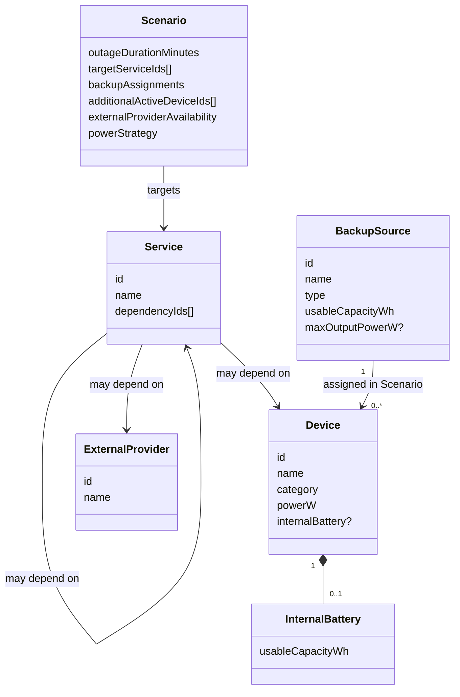
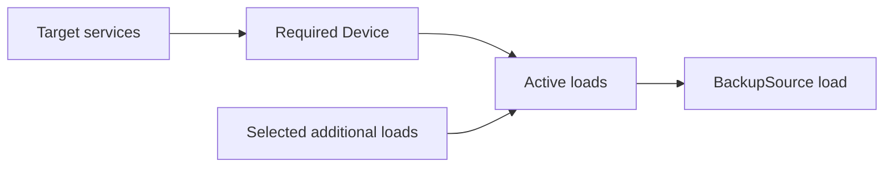

# Предметна модель

## 1. Призначення

Документ визначає сутності та інваріанти user-facing MVP. Алгоритм service simulation залишається в `docs/SIMULATION.md`; деталі нової ітерації — у `docs/specs/user-facing-mvp-v1.md`.

## 2. Загальна модель



## 3. `Service`

```text
Service
- id: string
- name: string
- dependencyIds: string[]
```

Правила:

- залежність: `Service | Device | ExternalProvider`;
- усі додані dependencies обов’язкові;
- дублікати dependencyIds заборонені;
- цикли заборонені;
- `Service` не має власної постійної availability;
- один Service може бути спільною залежністю кількох інших Service.

У user-facing MVP Service створюється з predefined template/variant. Template визначає dependency roles, cardinality та дозволені Device categories. Довільний graph editor поза scope.

## 4. `Device`

```text
Device
- id: string
- name: string
- category: DeviceCategory
- powerW: number
- internalBattery?:
    usableCapacityWh: number
```

Інваріанти:

- `powerW > 0`;
- `internalBattery.usableCapacityWh > 0`, якщо батарея задана;
- internal battery належить лише цьому Device;
- Device не може живити інші Device;
- Device залишається leaf node для `Simulation Engine v1`.

Його `availabilityMinutes` не вводиться користувачем напряму: її формує `Availability Estimator` для конкретного Scenario.

## 5. `ExternalProvider`

```text
ExternalProvider
- id: string
- name: string
```

- leaf node;
- не має власних dependencies;
- availability задається вручну в конкретному Scenario;
- автоматичні зовнішні інтеграції поза MVP.

## 6. `BackupSource`

```text
BackupSource
- id: string
- name: string
- type: PowerStation | UPS | Other
- usableCapacityWh: number
- maxOutputPowerW?: number
```

Інваріанти:

- `usableCapacityWh > 0`;
- `maxOutputPowerW > 0`, якщо заданий;
- type — описова metadata і не змінює формулу;
- одне джерело може живити багато Device;
- один Device у Scenario має максимум одне зовнішнє джерело;
- `BackupSource → BackupSource` не підтримується.

`usableCapacityWh` означає доступний запас енергії на початку outage, а не nominal capacity.

## 7. `Scenario`

Користувацький input:

```text
Scenario
- outageDurationMinutes: integer
- targetServiceIds: string[]
- backupAssignments: DeviceId -> BackupSourceId?
- additionalActiveDeviceIds: string[]
- externalProviderAvailability: ExternalProviderId -> durationMinutes
- powerStrategy: ExternalFirst
```

Правила:

- `outageDurationMinutes > 0`;
- `targetServiceIds` непорожній і без дублікатів;
- required Device визначаються автоматично з dependency graph target services;
- required Device не можна вимкнути;
- additional loads не визначають service availability, але споживають енергію призначеного BackupSource;
- усі часові значення — цілі хвилини;
- `ExternalFirst`: Device спочатку використовує зовнішній BackupSource, потім власну internal battery.

## 8. Перетворення у contract Simulation Engine

`Availability Estimator` формує існуючий engine input:

```text
Engine Scenario
- outageDurationMinutes
- targetServiceIds
- availability: nodeId -> durationMinutes
```

`availability` містить:

- Device → розраховані estimator хвилини;
- ExternalProvider → значення з Scenario input.

`Simulation Engine v1` після цього працює без зміни свого базового контракту.

## 9. Active loads



Усі Device, призначені одному BackupSource та активні в Scenario, вважаються активними протягом усього runtime цього джерела. Динамічне вимкнення навантажень поза scope v1.

## 10. Availability Estimator invariants

Для BackupSource:

```text
totalPowerW = Σ active Device.powerW
sourceRuntimeMinutes = floor(usableCapacityWh / totalPowerW × 60)
```

Для internal battery:

```text
internalRuntimeMinutes = floor(usableCapacityWh / Device.powerW × 60)
```

Device availability:

```text
external + internal = sourceRuntime + internalRuntime
external only       = sourceRuntime
internal only       = internalRuntime
no backup           = 0
```

Якщо задано `maxOutputPowerW` і `totalPowerW > maxOutputPowerW` → validation error.

Якщо `maxOutputPowerW` не задано → розрахунок дозволений із warning.

## 11. Service templates

User-facing MVP використовує predefined templates/variants для:

- Internet;
- Remote Work;
- Refrigeration;
- Heating;
- Water Supply.

Конкретний catalog, roles, cardinality та allowed categories є частиною `docs/specs/user-facing-mvp-v1.md` і не дублюються тут.

Вибрані елементи ролей є обов’язковими dependencies. Кілька instances одного template дозволені.

`ServiceInstance` є user-facing конфігурацією template/variant. Після успішної
template validation `service-builder.js` проєктує його у незмінний engine
`Service` через `id`, `name` і derived `dependencyIds`. Поля `templateId`,
`variantId` та `dependencyBindings` залишаються поза контрактом `Simulation
Engine v1`; UI не формує `dependencyIds` напряму.

## 12. Структурна цілісність

- кожен `id` унікальний;
- усі посилання вказують на існуючі сутності;
- service graph ациклічний;
- dependency roles відповідають template cardinality;
- Device category відповідає allowed categories role;
- один Device не має двох зовнішніх BackupSource в одному Scenario;
- потрібний ExternalProvider має задану availability.

Некоректна конфігурація повертає validation error, а не вигаданий simulation result.

## 13. Межа відповідальності

`Availability Estimator` відповідає лише за Device availability.

`Simulation Engine v1` відповідає за:

- Service availability;
- `Available | Limited | Unavailable`;
- limiting dependency/dependencies;
- causal path/paths.

Це розділення є архітектурним інваріантом MVP.
