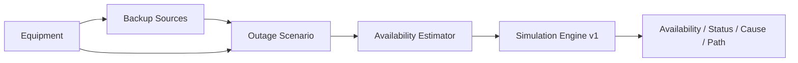

# Проєкт

## 1. Формат і тема

Індивідуальний магістерський інженерний проєкт, Master of Science in Computer Science, Software Engineering, Neoversity.

Робоча тема:

**«Оцінювання доступності критичних побутових сервісів під час відключень електроенергії на основі моделі функціональних залежностей»**.

«Критичні побутові сервіси» — важливі для конкретного користувача сервіси, а не юридично визначені об’єкти критичної інфраструктури.

## 2. Проблема

Автономність окремого пристрою не визначає доступність сервісу в цілому, якщо сервіс залежить від інших пристроїв, сервісів або зовнішньої інфраструктури.

Система відповідає на три питання: **чи буде потрібний сервіс доступним, як довго та що обмежує його роботу**.

## 3. Кінцевий користувач

Мешканець квартири або приватного будинку, який використовує чи планує резервне живлення та хоче оцінити доступність важливих побутових сервісів під час відключення.

Користувач не повинен знати внутрішню часову модель simulation engine або мати спеціальні знання із системного моделювання.

## 4. Мета

Розробити вебсистему, яка за моделлю функціональних залежностей оцінює тривалість доступності вибраних побутових сервісів у заданому сценарії відключення та пояснює обмежувальну залежність.

## 5. Основні завдання

1. Описати побутові сервіси та їхні функціональні залежності.
2. Описати локальні Device, резервне живлення та ExternalProvider.
3. Оцінити доступність Device із характеристик навантаження і резервного живлення.
4. Виконати simulation для заданої тривалості відключення.
5. Визначити `availability`, `status`, limiting dependency/dependencies і causal path/paths.
6. Перевірити коректність розрахунків і зрозумілість основного користувацького сценарію.

## 6. Gap і позиціонування новизни

Серед проаналізованих побутових рішень не виявлено публічно описаної функціональності, яка одночасно поєднує:

- явне багаторівневе моделювання залежностей сервісу;
- часову оцінку для заданого відключення;
- причинне пояснення залежності, що обмежує доступність сервісу.

Коректне формулювання — **«серед проаналізованих рішень»**, а не твердження про повну відсутність аналогів.

Новизна позиціонується як спрощена адаптація моделювання функціональних залежностей до побутового сценарію з часовою оцінкою та причинним поясненням.

## 7. Практична цінність

Система допомагає оцінити не лише автономність окремого обладнання, а доступність потрібного сервісу в цілому та визначити, чи обмеження знаходиться у локальному обладнанні, резервному живленні або зовнішній залежності.

## 8. MVP

Один тип події: **відключення електроенергії**.

Predefined service catalog:

- Internet;
- Remote Work;
- Refrigeration;
- Heating;
- Water Supply.

Користувацький flow:



Ядро MVP:

1. опис Device: category, `powerW`, optional internal battery;
2. опис BackupSource: `usableCapacityWh`, optional `maxOutputPowerW`;
3. створення сервісів із predefined templates/variants;
4. вибір target services та additional loads;
5. ручне задання availability для потрібних ExternalProvider;
6. оцінювання availability локальних Device;
7. валідація конфігурації та сценарію;
8. передача отриманого `Scenario.availability` у незмінений `Simulation Engine v1`;
9. відображення тривалості, статусу, limiting cause/path, warnings і детермінованих рекомендацій.

Детальний contract: `docs/specs/user-facing-mvp-v1.md`.

## 9. Межі MVP

Не входять:

- автоматична оптимізація енергоспоживання;
- часові графіки вмикання/вимикання Device;
- каскади або послідовні зовнішні BackupSource для одного Device;
- заряджання internal battery від BackupSource;
- детальна AC/DC/інверторна/акумуляторна фізична модель;
- автоматичне визначення характеристик обладнання;
- автоматичні дані ExternalProvider або графіків відключень;
- AI;
- accounts;
- backend/DB без окремої вимоги;
- microservices, Kubernetes, CQRS, event-driven architecture.

## 10. Архітектурна модель

Simulation core зберігає три типи вузлів:

- `Service`;
- `Device`;
- `ExternalProvider`.

Новий user-facing layer додає:

- характеристики Device та optional internal battery;
- `BackupSource`;
- predefined service templates/variants;
- `Availability Estimator`.

Правила:

- усі змодельовані service dependencies є обов’язковими;
- цикли заборонені;
- Device та ExternalProvider залишаються leaf nodes для `Simulation Engine v1`;
- Device availability для engine розраховує estimator;
- ExternalProvider availability задається вручну в Scenario;
- engine contract і правила status/bottleneck/path не змінюються.

Детальні інваріанти: `docs/DOMAIN_MODEL.md`.

## 11. Логіка станів

Нехай `H` — тривалість outage, `T` — розрахована availability сервісу:

- `Available`: `T >= H`;
- `Limited`: `0 < T < H`;
- `Unavailable`: `T = 0`.

Simulation contract: `docs/SIMULATION.md`.

## 12. Архітектурний етап

React SPA залишається основною архітектурою MVP.

- domain/estimation/simulation logic відокремлюється від React-компонентів;
- розрахунок виконується client-side;
- backend не потрібен для перевірки основної гіпотези.

Поточний deployed Internet UI — завершений **vertical slice**, а не фінальна UX-модель.

## 13. Тестування та оцінювання

Передбачено:

- unit tests для estimator і simulation/domain logic;
- template/validation tests;
- integration tests `Scenario → Estimator → Simulation Engine`;
- functional/usability testing основного flow.

Performance вимірюється лише за наявності обґрунтованої потреби. Числові результати фіксуються тільки після фактичного тестування.

Трасування:

`Requirement → Implementation → Test → Result`.

## 14. Simulation Engine v1

`Simulation Engine v1` уже реалізований і залишається без зміни базового контракту.

Для кожного Service:

`T(Service) = min(T(required dependencies))`.

Якщо кілька leaf dependencies мають однаковий minimum, engine повертає всі рівнозначні limiting dependencies і відповідні causal paths.

## 15. Історичний контрольний сценарій

Перший vertical slice:

```text
Internet
├─ Router
├─ ONT/ONU
└─ Internet Provider
```

Fixture `6 / 8 / 2 / 72 h` дає `2 h`, `Limited`, `ONT/ONU`, `Internet → ONT/ONU`.

Це тестові дані, не результати реальних вимірювань автономності.

## 16. Поточна user-facing специфікація

Погоджено `docs/specs/user-facing-mvp-v1.md`.

Ключовий принцип:

**користувач описує реальне обладнання та резервне живлення → система оцінює Device availability → перевірений Simulation Engine оцінює доступність сервісів і пояснює причину обмеження**.
