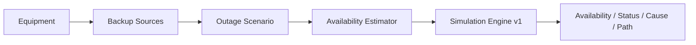

# Поточний стан проєкту

## Поточний етап

Завершено й прийнято:

- `Simulation Engine v1`;
- `React Demo v1`;
- `Deploy v1`;
- дизайн `User-facing MVP v1`;
- acceptance scenarios `AC-01…AC-14`;
- implementation plan `docs/plans/user-facing-mvp-v1.md`.

Live demo: https://serhii-palamarchuk.github.io/capstone-household-service-availability/

Поточний Internet UI — стабільний технічний **vertical slice**, не фінальна UX-модель.

## Supervisor checkpoint

Weekly Capstone Progress Report — Week 2 відправлено Тетяні через LMS; у Slack надіслано report + live demo.

Статус: **submitted → awaiting supervisor feedback**.

## User-facing MVP v1

Погоджено:

- `D-003 — Користувацький рівень введення після React Demo v1`;
- `D-004 — User-facing MVP v1 contract`;
- `docs/specs/user-facing-mvp-v1.md`;
- `docs/specs/user-facing-mvp-v1-acceptance.md`;
- `docs/plans/user-facing-mvp-v1.md`.

Ключове:

- Device: `powerW` + optional internal battery;
- BackupSource: usable capacity + optional max output power;
- shared-source runtime залежить від сумарного active load;
- predefined templates: Internet, Remote Work, Refrigeration, Heating, Water Supply;
- target services визначають mandatory loads;
- TV/lamp тощо — additional loads;
- ExternalProvider availability задається вручну;
- `Simulation Engine v1` не змінюється.

## Implementation checkpoint — isolated branch

Користувач окремо дозволив почати реалізацію до отримання feedback Тетяни за умови повної ізоляції від стабільного demo.

Feature branch:

`feature/user-facing-mvp-v1`

Правила:

- увесь новий код `User-facing MVP v1` робити тільки в feature branch;
- `main` залишати стабільним для перегляду Тетяною;
- не merge у `main`, доки не завершені всі tasks, tests/build і final review;
- GitHub Pages workflow автоматично deploy-ить тільки push у `main` для `apps/web/**` або workflow, тому feature branch не змінює live demo;
- після готовності гілки merge/deploy робити лише за окремим рішенням користувача.

Implementation mode: task-by-task `Developer → tests → Reviewer`, після всіх tasks — final whole-branch review.

## Активне implementation task

Дозвіл на coding cycle отримано. Наступний task: **Task 1 — Service catalog + template-safe ServiceInstance** з `docs/plans/user-facing-mvp-v1.md` у branch `feature/user-facing-mvp-v1`.

## Остання підтверджена стабільна baseline

- Simulation Engine final suite: `43 passed, 0 failed`;
- React Demo / full suite: `53 passed, 0 failed`;
- production build: exit `0`, Vite `8.2.1`;
- GitHub Pages: live HTTPS deployment accepted.

Це baseline попереднього стабільного milestone. Для нового User-facing MVP фактичних test results ще немає.

## Source of truth

- Google Drive `Capstone Project Context — Software Engineering` — canonical cross-chat context;
- `docs/STATUS.md` — поточний operational snapshot;
- `docs/PROJECT.md` — problem / goal / MVP / scope;
- `docs/DOMAIN_MODEL.md` — entities та invariants;
- `docs/SIMULATION.md` — existing engine contract;
- `docs/specs/user-facing-mvp-v1.md` — accepted contract;
- `docs/specs/user-facing-mvp-v1-acceptance.md` — accepted AC-01…AC-14;
- `docs/plans/user-facing-mvp-v1.md` — implementation plan;
- `docs/DECISIONS.md` — decision log;
- `docs/specs/repository-workflow.md` — agent workflow.

## Наступна дія

Почати Task 1 в `feature/user-facing-mvp-v1`. `main` і live deployment не змінювати.