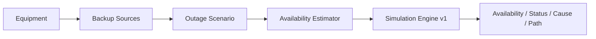

# Поточний стан проєкту

## Поточний етап

Завершено й прийнято:

- `Simulation Engine v1`;
- `React Demo v1`;
- `Deploy v1`;
- дизайн `User-facing MVP v1`.

Live demo: https://serhii-palamarchuk.github.io/capstone-household-service-availability/

Поточний Internet UI — технічний **vertical slice**, не фінальна UX-модель.

## Supervisor checkpoint — 2026-08-19

Weekly Capstone Progress Report — Week 2 відправлено Тетяні через LMS; у Slack додатково надіслано повідомлення про report і live demo.

Статус: **submitted → awaiting supervisor feedback**.

## Погоджений наступний продуктовый contract

Прийнято:

- `D-003 — Користувацький рівень введення після React Demo v1`;
- `D-004 — User-facing MVP v1 contract`;
- `docs/specs/user-facing-mvp-v1.md`.

Ключове:

- Device: `powerW` + optional internal battery;
- BackupSource: usable capacity + optional max output power;
- shared-source runtime залежить від сумарного active load;
- predefined templates: Internet, Remote Work, Refrigeration, Heating, Water Supply;
- target services визначають mandatory loads;
- TV/lamp тощо — additional loads;
- ExternalProvider availability задається вручну;
- `Simulation Engine v1` не змінюється.

Canonical docs `PROJECT.md`, `DOMAIN_MODEL.md`, `DECISIONS.md` синхронізовані з погодженою spec.

## Активне implementation task

Немає.

Новий coding cycle не запускати до:

1. acceptance scenarios для `User-facing MVP v1`;
2. implementation plan;
3. окремого рішення користувача почати реалізацію, якщо feedback керівника ще не отримано.

## Остання фактична перевірка

- Simulation Engine final suite: `43 passed, 0 failed`;
- React Demo / full suite: `53 passed, 0 failed`;
- production build: exit `0`, Vite `8.2.1`;
- GitHub Pages: live HTTPS deployment accepted;
- manual smoke:
  - `6 / 8 / 2 / 72 h` → `Limited`, `2 h`, `ONT/ONU`, `Internet → ONT/ONU`;
  - `6 / 8 / 8 / 72 h` → `Available`, `8 h`, no limiting dependency/path.

Це програмні fixture-сценарії, не реальні вимірювання автономності.

## Source of truth

- `docs/PROJECT.md` — problem / goal / MVP / scope;
- `docs/DOMAIN_MODEL.md` — entities та invariants;
- `docs/SIMULATION.md` — existing engine contract;
- `docs/specs/user-facing-mvp-v1.md` — accepted next-iteration contract;
- `docs/TEST_SCENARIOS.md` — acceptance scenarios;
- `docs/DECISIONS.md` — decision log;
- `docs/specs/repository-workflow.md` — agent workflow.

## Наступна дія

Сформувати стислий набір acceptance scenarios для нового Estimator + templates + наскрізної інтеграції. Після їх погодження — implementation plan. Код поки не змінювати.
