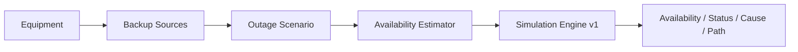

# Поточний стан проєкту

## Поточний етап

Завершено й прийнято:

- `Simulation Engine v1`;
- `React Demo v1`;
- `Deploy v1`;
- дизайн `User-facing MVP v1`;
- acceptance scenarios `AC-01…AC-14` для `User-facing MVP v1`.

Live demo: https://serhii-palamarchuk.github.io/capstone-household-service-availability/

Поточний Internet UI — технічний **vertical slice**, не фінальна UX-модель.

## Supervisor checkpoint — 2026-08-19

Weekly Capstone Progress Report — Week 2 відправлено Тетяні через LMS; у Slack додатково надіслано повідомлення про report і live demo.

Статус: **submitted → awaiting supervisor feedback**.

## Погоджений наступний продуктовий contract

Прийнято:

- `D-003 — Користувацький рівень введення після React Demo v1`;
- `D-004 — User-facing MVP v1 contract`;
- `docs/specs/user-facing-mvp-v1.md`;
- `docs/specs/user-facing-mvp-v1-acceptance.md`.

Ключове:

- Device: `powerW` + optional internal battery;
- BackupSource: usable capacity + optional max output power;
- shared-source runtime залежить від сумарного active load;
- predefined templates: Internet, Remote Work, Refrigeration, Heating, Water Supply;
- target services визначають mandatory loads;
- TV/lamp тощо — additional loads;
- ExternalProvider availability задається вручну;
- `Simulation Engine v1` не змінюється.

Підготовлено implementation plan:

- `docs/plans/user-facing-mvp-v1.md`;
- 7 послідовних task gates: templates → estimator → engine integration → recommendations → Equipment/Backup UI → Services/Scenario/Result UI → final verification.

## Активне implementation task

Немає. Код `User-facing MVP v1` ще не реалізується.

Перед Task 1 потрібне явне рішення користувача почати coding cycle. Якщо feedback Тетяни на той момент ще немає, це рішення означатиме свідомо продовжити реалізацію до feedback.

## Остання фактична перевірка

- Simulation Engine final suite: `43 passed, 0 failed`;
- React Demo / full suite: `53 passed, 0 failed`;
- production build: exit `0`, Vite `8.2.1`;
- GitHub Pages: live HTTPS deployment accepted;
- manual smoke:
  - `6 / 8 / 2 / 72 h` → `Limited`, `2 h`, `ONT/ONU`, `Internet → ONT/ONU`;
  - `6 / 8 / 8 / 72 h` → `Available`, `8 h`, no limiting dependency/path.

Це програмні fixture-сценарії, не реальні вимірювання автономності. Для нового User-facing MVP фактичних test results ще немає.

## Source of truth

- `docs/PROJECT.md` — problem / goal / MVP / scope;
- `docs/DOMAIN_MODEL.md` — entities та invariants;
- `docs/SIMULATION.md` — existing engine contract;
- `docs/specs/user-facing-mvp-v1.md` — accepted next-iteration contract;
- `docs/specs/user-facing-mvp-v1-acceptance.md` — accepted AC-01…AC-14;
- `docs/plans/user-facing-mvp-v1.md` — implementation plan;
- `docs/TEST_SCENARIOS.md` — existing Simulation Engine acceptance scenarios;
- `docs/DECISIONS.md` — decision log;
- `docs/specs/repository-workflow.md` — agent workflow.

## Наступна дія

Погодити implementation plan і окремо вирішити, чи запускати Task 1 зараз до supervisor feedback, чи чекати відповіді Тетяни. До цього код не змінювати.