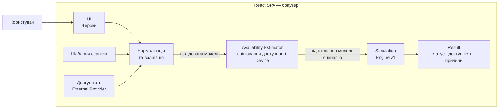

# Архітектура User-facing MVP

Схема показує фактичний runtime flow поточного MVP. Шаблони сервісів і ручна доступність External Provider є частиною клієнтського сценарію та обробляються всередині React SPA. Після нормалізації й валідації Availability Estimator доповнює валідовану модель розрахованою часовою доступністю Device. Підготовлена модель сценарію передається до Simulation Engine v1, який визначає доступність сервісу, статус і причини обмеження. Backend і база даних у поточному MVP відсутні.

Контракт схеми узгоджений із `docs/specs/user-facing-mvp-v1.md`, `docs/DECISIONS.md` і `docs/STATUS.md`.

Raw Mermaid source: [`mvp-architecture.mmd`](./mvp-architecture.mmd).
