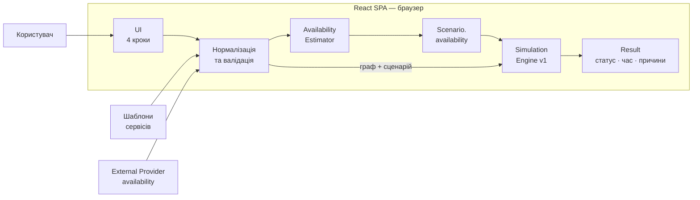

# Архітектура User-facing MVP

Схема показує фактичний runtime flow поточного MVP: введення даних → валідація → оцінювання часової доступності Device → Simulation Engine v1 → результат. Backend і база даних у поточному MVP відсутні.

Контракт схеми узгоджений із `docs/specs/user-facing-mvp-v1.md`, `docs/DECISIONS.md` і `docs/STATUS.md`.

Raw Mermaid source: [`mvp-architecture.mmd`](./mvp-architecture.mmd).
