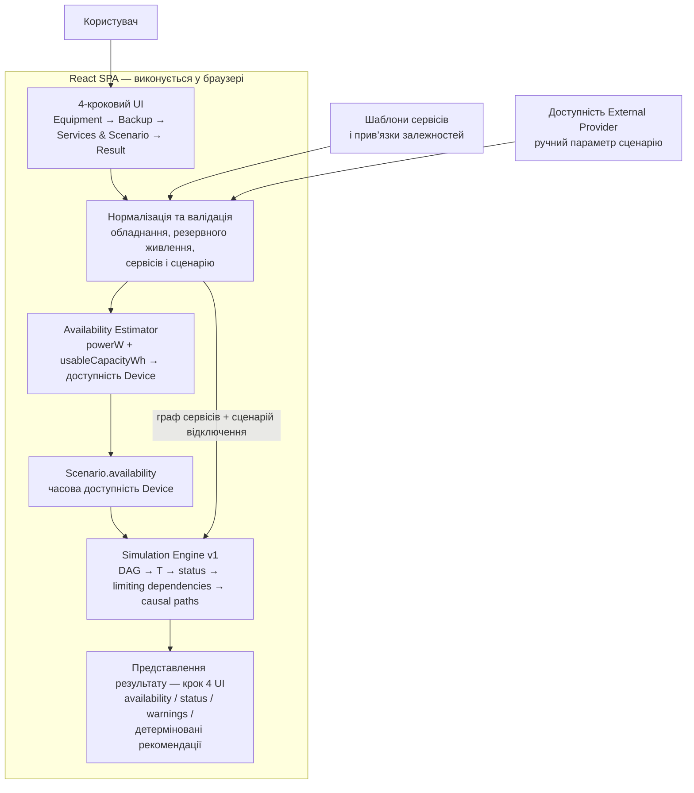

# Архітектура User-facing MVP

Ця схема фіксує фактичний runtime flow поточного MVP після `User-facing MVP v1` та `UX Polish v1`.

## Що показує схема

- Користувач вводить дані через 4-кроковий React UI: `Equipment → Backup → Services & Scenario → Result`.
- Шаблони сервісів задають дозволену структуру залежностей; довільного редактора графа в MVP немає.
- Нормалізація та валідація перевіряють користувацьку конфігурацію перед розрахунком.
- `Availability Estimator` перетворює `powerW` і доступну енергоємність у часову доступність `Device` та формує `Scenario.availability`.
- `Simulation Engine v1` отримує валідовану модель сервісів, сценарій відключення та `Scenario.availability`, після чого розраховує тривалість доступності сервісів, статус, обмежувальні залежності й причинні шляхи.
- Доступність `External Provider` залишається ручним параметром сценарію.
- Представлення результату є частиною четвертого кроку UI й показує availability/status, warnings та лише детерміновані рекомендації, що прямо випливають із моделі.
- Backend і база даних у поточному MVP відсутні. Deployment окремо зафіксований у D-002: `main → GitHub Actions → GitHub Pages`.

## Source of truth

Контракт схеми узгоджений із:

- `docs/specs/user-facing-mvp-v1.md`;
- `docs/DECISIONS.md` — D-002, D-003, D-004, D-005;
- `docs/STATUS.md`.

Raw Mermaid source: [`mvp-architecture.mmd`](./mvp-architecture.mmd).
