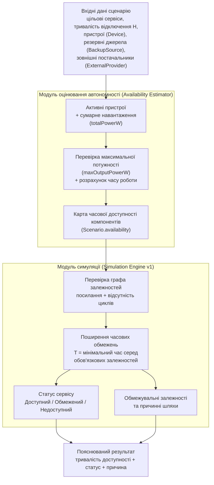

# Діаграма алгоритмічної послідовності оцінювання доступності сервісу

Компактна Mermaid-діаграма для Рисунка 3.2 у пояснювальній записці. Вона показує два відокремлені розрахункові етапи: модуль оцінювання автономності (Availability Estimator) формує часову доступність компонентів сценарію, після чого модуль симуляції (Simulation Engine v1) поширює часові обмеження через граф функціональних залежностей.

Діаграма навмисно не відтворює кожну внутрішню гілку валідації: детальні правила для `maxOutputPowerW`, внутрішньої батареї, зовнішніх постачальників і структурних помилок описані в §3.4 та канонічних специфікаціях. Це дозволяє зберегти рисунок читабельним на одній сторінці без втрати основної послідовності обчислень.

Канонічні правила розрахунку: `docs/specs/user-facing-mvp-v1.md`, `docs/SIMULATION.md`, `apps/web/src/user-mvp/` і `apps/web/src/simulation/`.
