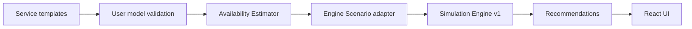

# User-facing MVP v1 Implementation Plan

> **For agentic workers:** REQUIRED SUB-SKILL: use `superpowers:subagent-driven-development` (recommended) or `superpowers:executing-plans` to implement this plan task-by-task. Steps use checkbox (`- [ ]`) syntax for tracking.

**Goal:** реалізувати user-facing flow `Equipment → Backup → Services & Scenario → Result`, де Device availability обчислюється з W/Wh і передається в незмінений `Simulation Engine v1`.

**Architecture:** нова логіка ізольована в `apps/web/src/user-mvp/`. Вона валідовує predefined service templates, визначає mandatory/additional loads, рахує Device availability, формує engine `Scenario.availability`, викликає існуючий `simulate()` та додає пояснювані рекомендації. React лише збирає input і показує результат.

**Tech Stack:** React 19, JavaScript ES modules, Vite 8, `node:test` + `node:assert/strict`. Нових dependencies немає.

**Spec:** `docs/specs/user-facing-mvp-v1.md`

**Acceptance:** `docs/specs/user-facing-mvp-v1-acceptance.md` (`AC-01…AC-14`)

## Global Constraints

- `apps/web/src/simulation/` не змінювати без окремого рішення: engine contract уже прийнятий.
- Тільки `ExternalFirst`; інших power strategies не додавати.
- `usableCapacityWh` — доступна енергія на початку outage; efficiency coefficient не додавати.
- Усі runtime values — цілі хвилини, округлення `Math.floor`.
- Mandatory Device визначаються target services; additional loads лише споживають енергію.
- `ExternalProvider` availability вводиться вручну.
- Не додавати backend, DB, persistence, AI, optimizer, dynamic load scheduling або новий testing framework.
- Числові результати в документацію переносити лише після фактичного test run.



---

## File structure

```text
apps/web/src/user-mvp/
├─ constants.js
├─ service-templates.js
├─ service-builder.js
├─ availability-estimator.js
├─ run-user-scenario.js
├─ recommendations.js
└─ form-state.js

apps/web/src/components/user-mvp/
├─ EquipmentStep.jsx
├─ BackupStep.jsx
├─ ServicesScenarioStep.jsx
└─ UserScenarioResult.jsx

apps/web/test/user-mvp/
├─ fixtures.js
├─ templates.test.js
├─ estimator.test.js
├─ integration.test.js
├─ recommendations.test.js
└─ form-state.test.js
```

User-facing `ServiceInstance` зберігає template metadata і derived engine dependencies:

```js
{
  id,
  name,
  templateId,
  variantId,
  dependencyBindings: { [roleId]: string[] },
  dependencyIds: string[]
}
```

`dependencyIds` формується тільки `service-builder.js`; UI не редагує його напряму. Extra metadata не впливає на `Simulation Engine v1`.

---

### Task 1: Service catalog + template-safe ServiceInstance

**Files:**
- Create: `apps/web/src/user-mvp/constants.js`
- Create: `apps/web/src/user-mvp/service-templates.js`
- Create: `apps/web/src/user-mvp/service-builder.js`
- Create: `apps/web/test/user-mvp/fixtures.js`
- Create: `apps/web/test/user-mvp/templates.test.js`
- Modify after acceptance: `docs/DOMAIN_MODEL.md` — явно зафіксувати `ServiceInstance → Service` projection, без зміни engine contract.

**Interfaces:**

```js
createServiceInstance(input, context)
// -> { success: true, service } | { success: false, errors }

getServiceTemplate(templateId, variantId)
// -> template variant | null
```

- [ ] **1. Написати failing tests для AC-08, AC-09, AC-10**

```js
test('AC-08: Remote Work accepts Internet + Laptop + two Monitors', () => {
  const result = createServiceInstance(remoteWorkInput(), templateContext());
  assert.equal(result.success, true);
  assert.deepEqual(result.service.dependencyIds, [
    'service-internet-home',
    'device-laptop',
    'device-monitor-1',
    'device-monitor-2',
  ]);
});

test('AC-08: Refrigerator cannot bind to Work Devices', () => {
  const result = createServiceInstance(remoteWorkWithRefrigerator(), templateContext());
  assert.equal(result.success, false);
  assert.ok(result.errors.some(x => x.code === 'TEMPLATE_ROLE_CATEGORY'));
});
```

- [ ] **2. Run і підтвердити FAIL**

```bash
cd apps/web
npm test -- test/user-mvp/templates.test.js
```

- [ ] **3. Реалізувати constants і catalog**

`DeviceCategory`:

```js
export const DeviceCategory = Object.freeze({
  ROUTER: 'Router',
  MODEM: 'Modem',
  ONT_ONU: 'ONT/ONU',
  LAPTOP_DESKTOP: 'Laptop/Desktop',
  MONITOR: 'Monitor',
  WORK_PERIPHERAL: 'Work Peripheral',
  REFRIGERATOR: 'Refrigerator',
  FREEZER: 'Freezer',
  GAS_BOILER: 'Gas Boiler',
  ELECTRIC_HEATER_BOILER: 'Electric Heater/Boiler',
  HEAT_PUMP: 'Heat Pump',
  WATER_PUMP: 'Water Pump',
  OTHER_LOAD: 'Other Load',
});
```

Catalog містить рівно variants зі spec: Internet `Fiber|RouterOnly`; Remote Work; Refrigeration; Heating `GasBoiler|Electric|Centralized`; Water Supply `Centralized|PrivateWell|PumpedSystem`. Role описує `id`, `entityType`, `cardinality: '1'|'1..N'`, `allowedCategories?`.

- [ ] **4. Реалізувати `createServiceInstance`**

Алгоритм: знайти variant → перевірити кожну role → перевірити cardinality/type/category → flatten bindings у `dependencyIds` без дублікатів → повернути `ServiceInstance`. Custom template id → error `TEMPLATE_NOT_FOUND`; неправильний variant → `TEMPLATE_VARIANT_NOT_FOUND`.

- [ ] **5. Run і підтвердити PASS**

```bash
npm test -- test/user-mvp/templates.test.js
```

- [ ] **6. Commit**

```bash
git add apps/web/src/user-mvp apps/web/test/user-mvp docs/DOMAIN_MODEL.md
git commit -m "feat: add predefined service template model"
```

---

### Task 2: Availability Estimator core

**Files:**
- Create: `apps/web/src/user-mvp/availability-estimator.js`
- Create: `apps/web/test/user-mvp/estimator.test.js`
- Modify: `apps/web/test/user-mvp/fixtures.js`

**Interfaces:**

```js
estimateAvailability({ model, backupSources, scenario })
// success:
// {
//   success: true,
//   availability,
//   requiredDeviceIds,
//   sourceResults,
//   deviceResults,
//   warnings
// }
// failure: { success: false, errors }
```

Concrete UI representation of conceptual `DeviceId -> BackupSourceId` mapping:

```js
scenario.backupAssignments = [
  { deviceId: 'device-router', backupSourceId: 'source-1' },
];
```

Estimator rejects duplicate `deviceId` before normalization.

- [ ] **1. Написати failing tests AC-01…AC-06**

```js
test('AC-01: floors runtime to integer minutes', () => {
  const result = estimateAvailability(singleDeviceFixture({ wh: 100, watts: 33 }));
  assert.equal(result.availability['device-1'], 181);
});

test('AC-04: ExternalFirst adds internal runtime after source runtime', () => {
  const result = estimateAvailability(externalPlusInternalFixture());
  assert.equal(result.availability['device-laptop'], 420);
});
```

Також окремо перевірити shared source `600 Wh / 100 W = 360 min`, no-backup `0`, invalid power/capacity, duplicate assignment, exceeded max output, missing max output warning.

- [ ] **2. Run і підтвердити FAIL**

```bash
npm test -- test/user-mvp/estimator.test.js
```

- [ ] **3. Реалізувати required-device traversal**

```js
function collectRequiredDeviceIds(model, targetServiceIds) {
  const required = new Set();
  const visitedServices = new Set();
  // DFS через dependencyIds; Device додається в required;
  // ExternalProvider пропускається; visitedServices запобігає recursion loop.
  return required;
}
```

Structural cycle/missing dependency verdict залишається за existing engine; estimator не зависає на такому input.

- [ ] **4. Реалізувати validation + formulas**

```js
const runtimeMinutes = Math.floor(
  (source.usableCapacityWh / totalPowerW) * 60,
);

const internalMinutes = device.internalBattery
  ? Math.floor((device.internalBattery.usableCapacityWh / device.powerW) * 60)
  : 0;
```

Active Device = `requiredDeviceIds ∪ additionalActiveDeviceIds`. Source load містить лише active Device, призначені цьому source. Unused source не генерує runtime/warning. Required Device без backup → `0 min`.

- [ ] **5. Додати ExternalProvider availability**

Required provider без `scenario.externalProviderAvailability[id]` → error `MISSING_EXTERNAL_PROVIDER_AVAILABILITY`. Валідне значення — integer `>= 0`; воно копіюється в `availability` без прогнозування.

- [ ] **6. Run і підтвердити PASS**

```bash
npm test -- test/user-mvp/estimator.test.js
```

- [ ] **7. Commit**

```bash
git add apps/web/src/user-mvp/availability-estimator.js apps/web/test/user-mvp
git commit -m "feat: estimate device availability from backup power"
```

---

### Task 3: Engine adapter + end-to-end orchestration

**Files:**
- Create: `apps/web/src/user-mvp/run-user-scenario.js`
- Create: `apps/web/test/user-mvp/integration.test.js`
- Modify: `apps/web/test/user-mvp/fixtures.js`

**Interfaces:**

```js
runUserScenarioCore({ model, backupSources, scenario })
// -> estimator failure OR
// {
//   success: true,
//   estimation,
//   simulation
// }
```

- [ ] **1. Написати failing integration tests AC-07, AC-10, AC-11, AC-12**

AC-12 must assert:

```js
assert.equal(result.estimation.sourceResults[0].runtimeMinutes, 360);
assert.equal(result.estimation.availability['device-router'], 360);
assert.equal(result.estimation.availability['device-ont'], 360);
assert.equal(result.estimation.availability['device-laptop'], 480);

const remoteWork = result.simulation.targetResults[0];
assert.equal(remoteWork.availabilityDurationMinutes, 360);
assert.equal(remoteWork.status, 'Limited');
assert.deepEqual(remoteWork.limitingDependencyIds.sort(), [
  'device-ont',
  'device-router',
]);
```

- [ ] **2. Run і підтвердити FAIL**

```bash
npm test -- test/user-mvp/integration.test.js
```

- [ ] **3. Реалізувати adapter**

```js
const engineScenario = {
  outageDurationMinutes: scenario.outageDurationMinutes,
  targetServiceIds: scenario.targetServiceIds,
  availability: estimation.availability,
};

const simulation = simulate(model, engineScenario);
```

Estimator failure → `simulate()` не викликається. Engine failure повертається без partial synthetic result.

- [ ] **4. Перевірити additional load counterexample AC-07**

Два runs одного model: без TV → `T(Internet)=1200`; з TV 70W → `T(Internet)=360`. TV не з’являється в `Internet.dependencyIds`.

- [ ] **5. Run full regression**

```bash
npm test
```

Очікування: zero failures; existing `TS-01…TS-29` regression залишається green.

- [ ] **6. Commit**

```bash
git add apps/web/src/user-mvp/run-user-scenario.js apps/web/test/user-mvp
git commit -m "feat: connect availability estimator to simulation engine"
```

---

### Task 4: Deterministic recommendations

**Files:**
- Create: `apps/web/src/user-mvp/recommendations.js`
- Create: `apps/web/test/user-mvp/recommendations.test.js`
- Modify: `apps/web/src/user-mvp/run-user-scenario.js`

**Interfaces:**

```js
buildRecommendations({ model, scenario, estimation, simulation, counterfactuals })
// -> Recommendation[]

runUserScenario(input)
// -> runUserScenarioCore(input) + recommendations
```

Recommendation object:

```js
{
  type: 'ADD_BACKUP' | 'EXTERNAL_PROVIDER_LIMIT' | 'DISABLE_ADDITIONAL_LOAD',
  entityId: string,
  improvementMinutes?: number
}
```

- [ ] **1. Написати failing tests AC-13**

```js
test('AC-13: zero-minute required Device recommends backup', () => {
  const recs = buildRecommendations(noBackupResult());
  assert.ok(recs.some(x => x.type === 'ADD_BACKUP' && x.entityId === 'device-ont'));
});
```

Provider bottleneck → `EXTERNAL_PROVIDER_LIMIT`. Additional load recommendation дозволена тільки якщо counterfactual run без цього load дає строго більший target availability.

- [ ] **2. Run і підтвердити FAIL**

```bash
npm test -- test/user-mvp/recommendations.test.js
```

- [ ] **3. Реалізувати counterfactual без recursion**

`runUserScenario()` спочатку викликає `runUserScenarioCore()`. Для кожного additional load формує scenario без цього одного id і викликає **тільки** `runUserScenarioCore()`. Різниця `target availability > 0` дає `DISABLE_ADDITIONAL_LOAD` з `improvementMinutes`.

- [ ] **4. Run і підтвердити PASS + regression**

```bash
npm test -- test/user-mvp/recommendations.test.js
npm test
```

- [ ] **5. Commit**

```bash
git add apps/web/src/user-mvp apps/web/test/user-mvp
git commit -m "feat: add deterministic resilience recommendations"
```

---

### Task 5: Form state + Equipment/Backup UI

**Files:**
- Create: `apps/web/src/user-mvp/form-state.js`
- Create: `apps/web/test/user-mvp/form-state.test.js`
- Create: `apps/web/src/components/user-mvp/EquipmentStep.jsx`
- Create: `apps/web/src/components/user-mvp/BackupStep.jsx`
- Modify: `apps/web/src/App.jsx`
- Modify: `apps/web/src/styles.css`

**Interfaces:**

```js
createInitialUserMvpState()
normalizeUserMvpForm(state)
// -> { success: true, model, backupSources, scenario } | { success: false, errors }
```

Initial state використовує AC-12 лише як editable demo fixture; UI явно не подає його як реальне вимірювання.

- [ ] **1. Написати failing form-state tests**

Перевірити number conversion, optional battery/max output, stable ids, assignment serialization і відсутність поля готового `availabilityMinutes` для Device.

- [ ] **2. Run і підтвердити FAIL**

```bash
npm test -- test/user-mvp/form-state.test.js
```

- [ ] **3. Реалізувати pure form conversion**

UI string inputs перетворюються у numbers тільки в `normalizeUserMvpForm`; invalid/blank required values повертають UI errors і не запускають domain calculation.

- [ ] **4. Реалізувати Equipment step**

Кожен Device row: `name`, `category`, `powerW`, optional `internalBatteryWh`; add/remove. No direct availability field.

- [ ] **5. Реалізувати Backup step**

BackupSource row: `name`, `type`, `usableCapacityWh`, optional `maxOutputPowerW`; add/remove. Для кожного Device — select максимум одного external source.

- [ ] **6. Run tests + build**

```bash
npm test -- test/user-mvp/form-state.test.js
npm run build
```

- [ ] **7. Commit**

```bash
git add apps/web/src apps/web/test/user-mvp
git commit -m "feat: add equipment and backup configuration UI"
```

---

### Task 6: Services/Scenario UI + Result UI

**Files:**
- Create: `apps/web/src/components/user-mvp/ServicesScenarioStep.jsx`
- Create: `apps/web/src/components/user-mvp/UserScenarioResult.jsx`
- Modify: `apps/web/src/App.jsx`
- Modify: `apps/web/src/styles.css`
- Modify: `apps/web/src/user-mvp/form-state.js`
- Modify: `apps/web/test/user-mvp/form-state.test.js`

**Produces:** full AC-14 user flow.

- [ ] **1. Додати form-state tests для service creation/scenario conversion**

Перевірити: template+variant, role bindings, multiple service instances, shared Internet service id, target ids, additional load ids, provider availability, outage minutes.

- [ ] **2. Реалізувати Services & Scenario step**

UI дозволяє:

```text
Add Service → choose template/variant → name → bind allowed roles
Choose target service(s)
Set outage duration
Select additional loads
Set required ExternalProvider availability
```

Role select options фільтруються за `entityType` і allowed Device categories; фінальна domain validation усе одно виконується `createServiceInstance`/runner.

- [ ] **3. Підключити `runUserScenario()` в App**

```js
const normalized = normalizeUserMvpForm(formState);
if (!normalized.success) return setErrors(normalized.errors);
setOutcome(runUserScenario(normalized));
```

Повторний submit після зміни input замінює outcome без page reload.

- [ ] **4. Реалізувати Result UI**

Показати:

- used BackupSource: total W + runtime min/h;
- Device availability;
- target Service availability + status;
- limiting dependency/dependencies + causal paths;
- warnings;
- recommendations.

При failure показати errors; не показувати fake partial result.

- [ ] **5. Run full tests + build**

```bash
npm test
npm run build
```

- [ ] **6. Commit**

```bash
git add apps/web/src apps/web/test/user-mvp
git commit -m "feat: complete user-facing outage scenario flow"
```

---

### Task 7: Acceptance verification + project synchronization

**Files:**
- Modify only after actual verification: `docs/STATUS.md`
- Modify if implementation reveals contract clarification: relevant canonical doc **only after user approval**.

- [ ] **1. Fresh automated verification**

```bash
cd apps/web
npm test
npm run build
```

Записати фактичні counts/exit codes; не використовувати попередні `53 passed` як результат нового MVP.

- [ ] **2. Functional walkthrough AC-14**

У browser пройти:

```text
Equipment → Backup → Services & Scenario → Result
```

Обов’язково перевірити AC-12 fixture і повторний run після зміни input без reload.

- [ ] **3. Manual negative smoke**

Перевірити UI для:

- `powerW = 0`;
- source load > known max output;
- missing required provider availability;
- missing template role.

Очікування: error, simulation не запускається.

- [ ] **4. Scope audit**

```bash
git diff -- apps/web/src/simulation
```

Очікування: порожньо. Також перевірити `package.json`: жодних нових dependencies.

- [ ] **5. Reviewer gate**

Fresh Reviewer перевіряє spec + AC-01…AC-14 + diff + фактичні test/build outputs. Findings: `Critical / Major / Minor`; виправлення проходять повторний Developer → Reviewer cycle.

- [ ] **6. Оновити STATUS тільки фактичними результатами**

Зафіксувати accepted commit, test counts, build exit code, manual walkthrough result і наступну дію. Якщо змінився scope/contract — окремо синхронізувати `DECISIONS.md` та Google Drive Capstone Project Context.

- [ ] **7. Final commit документації**

```bash
git add docs/STATUS.md
git commit -m "docs: record user-facing MVP v1 verification"
```

---

## Traceability

```text
AC-01…AC-06  -> Task 2
AC-07        -> Tasks 2–3
AC-08…AC-10  -> Task 1 + Task 3
AC-11        -> Tasks 2–3
AC-12        -> Task 3
AC-13        -> Task 4
AC-14        -> Tasks 5–7
TS-01…TS-29  -> full regression in Tasks 3, 4, 6, 7
```

## Execution rule

Не запускати implementation автоматично лише через наявність цього plan. Перед Task 1 потрібне явне рішення користувача почати coding cycle; далі кожен Task проходить `Developer → tests → Reviewer → acceptance`.