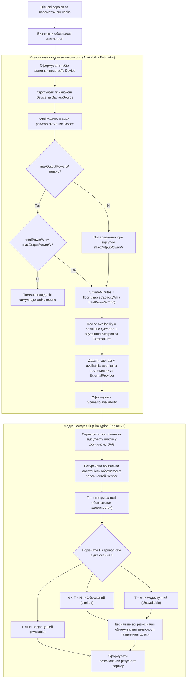

# Діаграма алгоритмічної послідовності оцінювання доступності сервісу

Ця Mermaid-діаграма відображає фактичну послідовність обробки сценарію в поточному MVP: модуль оцінювання автономності (Availability Estimator) формує часову доступність локальних пристроїв, після чого модуль симуляції (Simulation Engine v1) поширює часові обмеження через граф функціональних залежностей.

Канонічні правила розрахунку залишаються у `docs/specs/user-facing-mvp-v1.md`, `docs/SIMULATION.md` та відповідній реалізації в `apps/web/src/user-mvp/` і `apps/web/src/simulation/`.