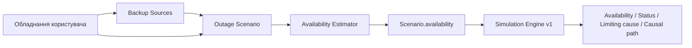
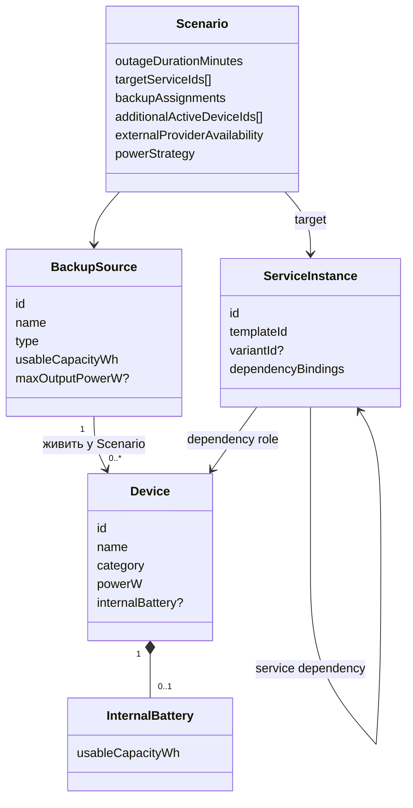
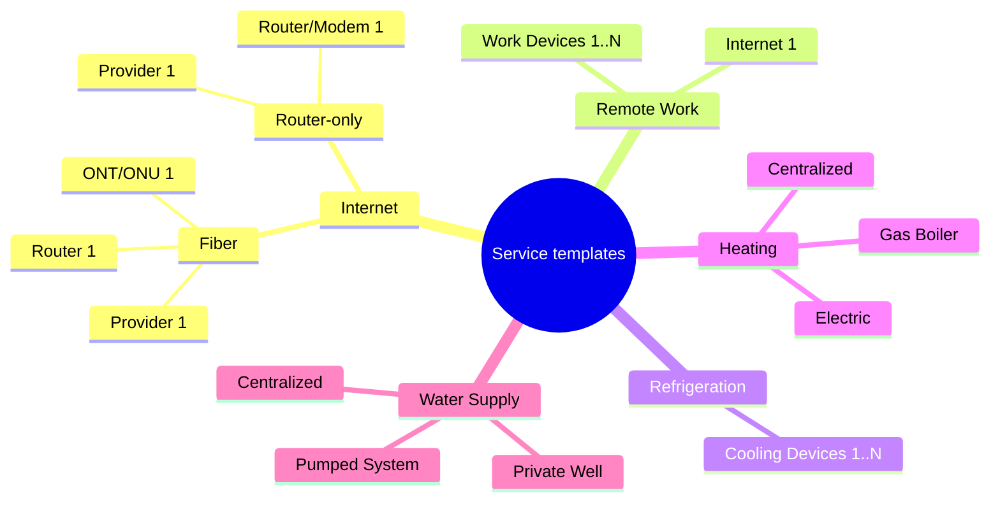
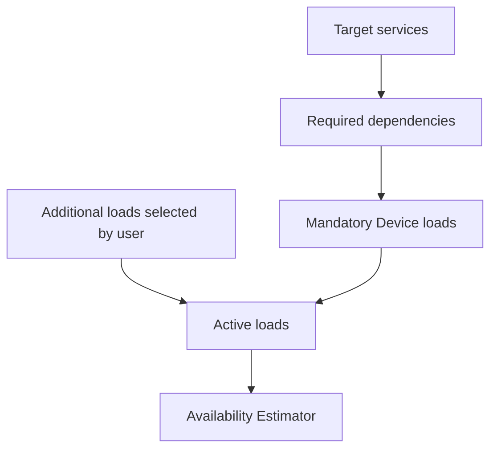
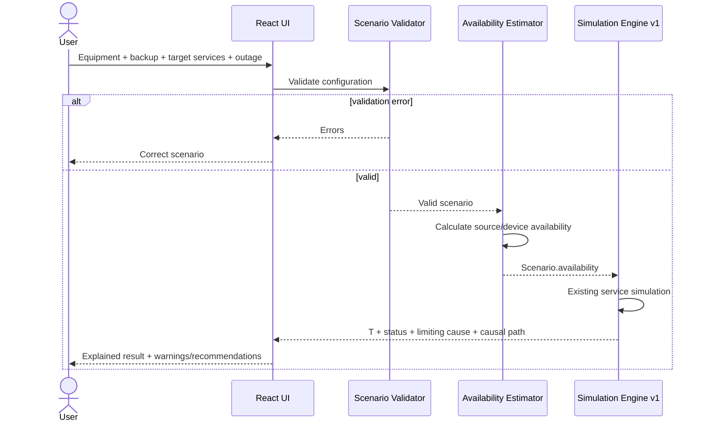

# User-facing MVP v1 — специфікація

## 1. Мета

Перейти від ручного введення готових `availabilityMinutes` до користувацької моделі:

**обладнання → резервне живлення → оцінка автономності → сервіси та залежності → `Simulation Engine v1` → пояснений результат**.

`Simulation Engine v1` не змінюється: новий `Availability Estimator` лише формує для нього `Scenario.availability`.



## 2. Межі MVP

У scope:

- `Device` з `powerW`;
- опційна внутрішня батарея Device;
- `BackupSource` з `usableCapacityWh` і опційним `maxOutputPowerW`;
- один зовнішній BackupSource на Device у межах сценарію;
- predefined service templates і variants;
- additional loads;
- ручна availability для `ExternalProvider`;
- `Availability Estimator`;
- validation errors / warnings;
- детерміновані рекомендації, якщо вони прямо випливають із моделі.

Поза scope:

- автоматична оптимізація розподілу енергії;
- часові графіки вмикання/вимикання Device;
- каскади `BackupSource → BackupSource`;
- кілька послідовних зовнішніх джерел для одного Device;
- заряджання internal battery від зовнішнього джерела;
- AC/DC, тип акумулятора, інверторні втрати та інша детальна електрична модель;
- автоматичне визначення характеристик обладнання;
- автоматичні дані провайдерів;
- AI.

## 3. Предметна модель



### Основні правила

- `Device.powerW > 0`.
- `InternalBattery.usableCapacityWh > 0`, якщо батарея задана.
- Internal battery належить тільки конкретному Device і не може живити інші пристрої.
- На початку outage internal battery вважається повністю зарядженою.
- `BackupSource.usableCapacityWh > 0` — доступний запас енергії на початку сценарію.
- `BackupSource.maxOutputPowerW` — опційний.
- Один BackupSource може живити багато Device.
- Один Device має максимум одне зовнішнє джерело в конкретному Scenario.
- Каскади зовнішніх джерел не підтримуються.
- Default strategy: `ExternalFirst` — спочатку зовнішнє джерело, після його вичерпання internal battery.

## 4. Service templates

Користувач не будує довільний граф сервісу. Він створює `ServiceInstance` з predefined template/variant і підставляє власні Device / ServiceInstance / ExternalProvider у дозволені dependency roles.



### Catalog v1

- **Internet / Fiber:** Router `[1]` + ONT/ONU `[1]` + Provider `[1]`.
- **Internet / Router-only:** Router/Modem `[1]` + Provider `[1]`.
- **Remote Work:** Internet Service `[1]` + Work Devices `[1..N]`.
- **Refrigeration:** Cooling Devices `[1..N]`.
- **Heating / Gas Boiler:** Heating Unit `[1]` + Gas Supply `[1]` (`ExternalProvider`).
- **Heating / Electric:** Heating Devices `[1..N]`.
- **Heating / Centralized:** Heating Provider `[1]` (`ExternalProvider`).
- **Water Supply / Centralized:** Water Provider `[1]` (`ExternalProvider`).
- **Water Supply / Private Well:** Water Pump `[1]`.
- **Water Supply / Pumped System:** Water Provider `[1]` + Water Pump `[1]`.

Кілька instances одного template дозволені. Кілька сервісів можуть повторно використовувати той самий existing `ServiceInstance` як спільну залежність.

## 5. Device categories

`Device` має predefined `category`; роль шаблону визначає дозволені категорії.

Приклади категорій v1:

`Router`, `ONT/ONU`, `Laptop/Desktop`, `Monitor`, `Work Peripheral`, `Refrigerator`, `Freezer`, `Gas Boiler`, `Electric Heater/Boiler`, `Heat Pump`, `Water Pump`, `Other Load`.

Назва конкретного Device довільна. Некоректна category для dependency role → validation error.

## 6. Mandatory і additional loads

`targetServiceIds` автоматично визначають required Device через граф залежностей. Required Device не можна вимкнути, поки відповідний target service активний.

`additionalActiveDeviceIds` — побутові навантаження, які не визначають доступність сервісу, але споживають енергію: Lamp, TV тощо.



## 7. Availability Estimator v1

Для кожного BackupSource:

```text
totalPowerW = Σ powerW усіх активних Device, призначених цьому source
sourceRuntimeMinutes = floor(usableCapacityWh / totalPowerW × 60)
```

Якщо `maxOutputPowerW` заданий і `totalPowerW > maxOutputPowerW` → validation error; simulation не запускається.

Якщо `maxOutputPowerW` не заданий → runtime розраховується, але повертається warning, що перевірку максимальної потужності не виконано.

Internal battery:

```text
internalRuntimeMinutes = floor(internalBattery.usableCapacityWh / Device.powerW × 60)
```

Device availability:

```text
external + internal  = sourceRuntime + internalRuntime
external only        = sourceRuntime
internal only        = internalRuntime
no backup            = 0
```

Усі тривалості округлюються вниз до цілої хвилини.

Estimator не перераховує навантаження динамічно після відмови окремого сервісу або provider — це свідоме спрощення v1.

## 8. Послідовність виконання сценарію



## 9. Validation

**Errors — simulation не запускається:**

- некоректні `powerW` / capacity;
- перевищено відомий `maxOutputPowerW`;
- mandatory role не заповнений;
- role `[1..N]` порожня;
- Device category не дозволена role;
- один Device призначений кільком зовнішнім source у Scenario;
- required ExternalProvider не має availability;
- цикли / інші чинні structural errors Simulation Engine.

**Warnings — simulation дозволена:**

- `maxOutputPowerW` не заданий для використовуваного source.

Device без backup — валідна конфігурація і отримує `0 min`.

## 10. Рекомендації

Рекомендація показується лише якщо вона детерміновано випливає з моделі.

Приклади:

- required Device без backup → запропонувати додати резервне живлення;
- перевищено `maxOutputPowerW` → зменшити навантаження або використати потужніше source;
- limiting cause = `ExternalProvider` → пояснити, що локальне збільшення батареї цю причину не усуває;
- вплив additional load можна стверджувати лише після фактичного перерахунку альтернативного сценарію.

Автоматичної оптимізації немає.

## 11. UI flow

1. **Equipment** — Device, category, `powerW`, optional internal battery.
2. **Backup** — BackupSource, capacity, optional max power, assignments.
3. **Services & Scenario** — service templates/variants, target services, additional loads, outage, ExternalProvider availability.
4. **Result** — source runtime, Device availability, service availability/status, limiting cause/path, warnings/recommendations.

## 12. Тестування

- **Unit:** estimator formulas, shared source, internal battery, no backup, rounding, max-power validation/warning.
- **Template validation:** cardinality, allowed categories, multiple instances, shared service dependency.
- **Integration:** `Household → Scenario → Estimator → Simulation Engine v1 → Result`.
- **Functional/usability:** створення обладнання, вибір template, scenario run, зрозумілість причини результату.

Числові результати фіксуються лише після фактичного запуску тестів.

## 13. Критерій успіху

Користувач може описати своє обладнання та резервне живлення, вибрати потрібні predefined services і outage scenario; система сама формує availability Device та через незмінений `Simulation Engine v1` повертає тривалість доступності сервісів, статус і причинне пояснення.

## 14. До реалізації

Перед coding cycle потрібно окремо:

1. синхронізувати цю модель з канонічними `PROJECT.md` / `DOMAIN_MODEL.md` / `DECISIONS.md`;
2. сформувати acceptance scenarios для нового шару;
3. створити implementation plan;
4. запускати `Developer → Reviewer` лише після погодження плану.
